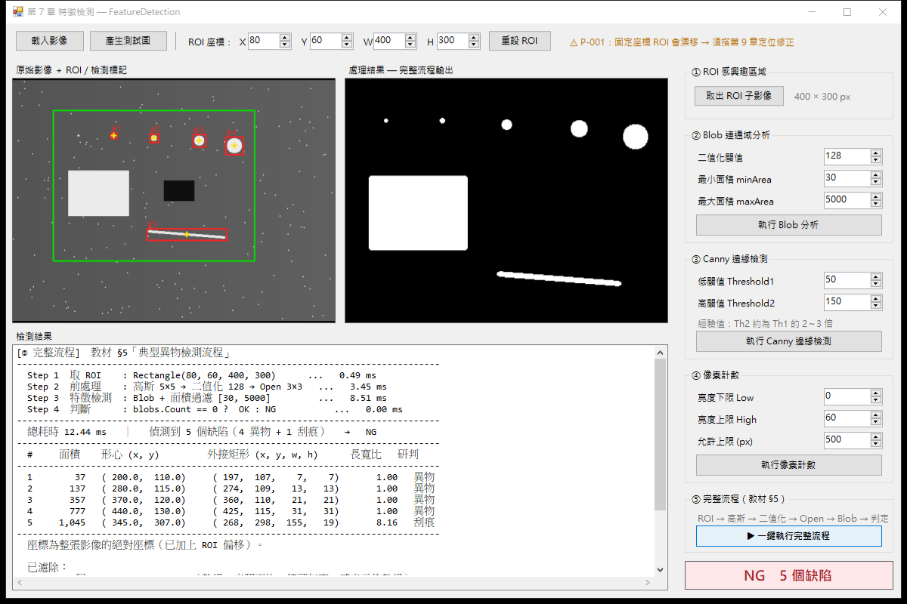
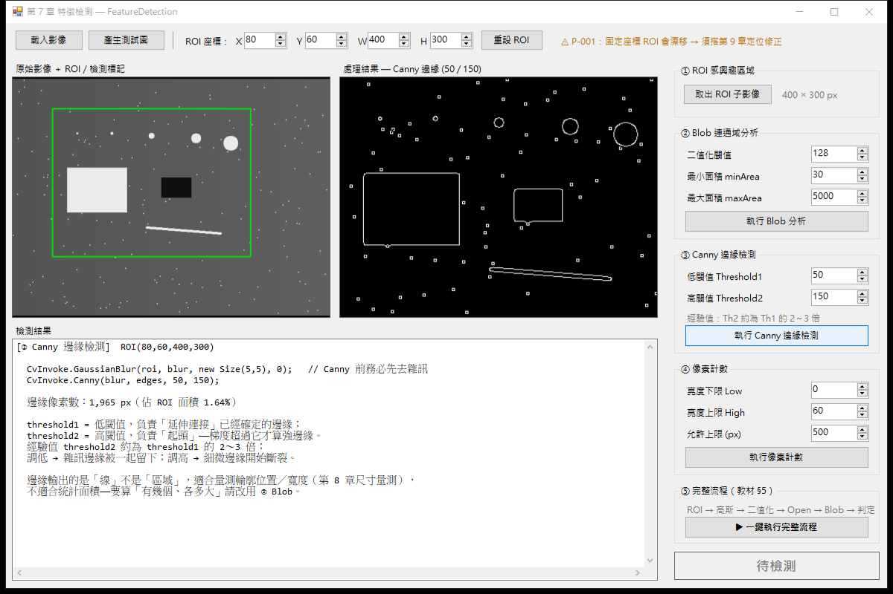

# FeatureDetection — 第 7 章 特徵檢測 範例程式

Medium文章連結 : https://medium.com/@GarnettChien/aoi-7-%E7%89%B9%E5%BE%B5%E6%AA%A2%E6%B8%AC-f604c0dc0bba?postPublishedType=repub

《AOI 工程師養成教材》第 7 章的隨堂範例。用最小可執行的 WinForms 程式，把四個特徵檢測工具跑給你看：
**ROI 感興趣區域**、**Blob 連通域分析**、**Canny 邊緣檢測**、**像素計數**。

不需要準備任何影像檔——程式內建合成測試圖產生器，按一個鈕就有圖可以測。



---

## 環境需求

| 項目 | 版本 | 說明 |
|------|------|------|
| Visual Studio | 2022 | 需勾選「.NET 桌面開發」 |
| .NET Framework | 4.7.2 開發套件 | Targeting Pack，非只有 Runtime |
| 作業系統 | Windows x64 | `cvextern.dll` 只有 x64／x86 原生版 |
| Emgu.CV | 4.4.0.4099 | 由 NuGet 還原，**不要升級**，原因見下 |

第一次開啟方案後 NuGet 會自動還原；若沒有，在 **Developer Command Prompt for VS 2022** 執行：

```bash
msbuild FeatureDetection.sln -t:restore
```

## 建置與執行

用 Visual Studio 開啟 `FeatureDetection.sln`，直接 F5。或在 Developer Command Prompt：

```bash
msbuild FeatureDetection.sln -t:restore,build -p:Configuration=Debug
```

執行檔輸出在 `FeatureDetection\bin\Debug\FeatureDetection.exe`。
建置時會看到 `Emgu.CV.runtime.windows nuget package deploying x86 x64 binary for Windows`，
代表原生 DLL 已複製到輸出目錄的 `x64\` 子資料夾——**沒有這行就一定跑不起來**。

## 操作流程

1. 按左上角 **「產生測試圖」**（或「載入影像」讀入自己的圖，會自動轉灰階）
2. 右側面板由上而下依序按 ① ～ ④，各自對應教材的一節
3. 或直接按 **⑤ 一鍵執行完整流程**，跑完教材 §5 的四步驟並顯示每步耗時

左側顯示原圖與檢測標記（綠框 = ROI、紅框 = 缺陷外接矩形、黃色十字 = 形心），
右側顯示該工具的中間影像，下方輸出完整的數據報告。

---

## 四個工具

| 工具 | 用途 | 什麼時候用 |
|------|------|-----------|
| ① ROI | 先框範圍，排除背景、加速計算 | 幾乎每個檢測的第一步 |
| ② Blob 連通域 | 統計「有幾塊、各多大、在哪裡」 | 異物、缺陷計數與定位 |
| ③ Canny 邊緣 | 偵測輪廓位置 | 量測尺寸、定位邊界（第 8 章） |
| ④ 像素計數 | 統計某亮度區間的像素數 | 「某種亮度的面積超標嗎」最快解 |

邊緣輸出的是「線」不是「區域」，不適合統計面積；要算「有幾個、各多大」請用 Blob。



上圖是 Canny 的輸出。滿畫面的小方框就是 200 個鹽雜訊的輪廓——
同一張圖在 Blob 流程裡被高斯 + Open 清得一乾二淨，在這裡卻全部被當成邊緣留下來。
這就是為什麼 `FeatureOps.DetectEdges()` 一定要先做高斯模糊，以及為什麼閾值要調。

## 內建測試圖

`640 × 480` 8-bit 灰階，每個元素都對應一個教學點：

| 元素 | 規格 | 教學點 |
|------|------|--------|
| 背景 | 灰階 90，含輕微水平梯度 | 模擬光照不均 |
| 白點 ×5 | 半徑 2 / 3 / 6 / 10 / 15 px | 前處理後實測面積 21 / 37 / 137 / 357 / 777 px |
| 白色大矩形 | 121 × 91（約 11,400 px） | 大於 `maxArea` → 視為產品本體排除 |
| 刮痕 | 近水平線 150 × 3 | 外接矩形 155 × 19，長寬比 8.16 → 判為刮痕 |
| 暗色汙染 | 61 × 41 = 2,501 px，灰階 15 | 供 ④ 像素計數判 NG |
| 鹽雜訊 | 200 個 2×2 白點 | 高斯 + Open 後**全數清除** |

每次產生的圖完全相同，方便對照講解。

---

## 專案結構

```
FeatureDetection\
├── FeatureDetection.sln
├── README.md
├── .gitignore
├── docs\                          README 用的截圖
└── FeatureDetection\
    ├── FeatureDetection.csproj    舊式專案檔（非 SDK-style）
    ├── App.config
    ├── Program.cs                 進入點
    ├── FeatureOps.cs              四個工具的純演算法，零 UI 相依
    ├── TestImageGenerator.cs      合成測試圖產生器
    ├── Form1.cs                   事件處理與影像顯示
    ├── Form1.Designer.cs          版面（ClientSize 1184 × 761）
    ├── Form1.resx
    └── Properties\AssemblyInfo.cs
```

`FeatureOps.cs` 刻意不碰任何 UI——所有方法只吃 `Mat`、吐 `Mat` 或數值，
方便單獨閱讀、單獨測試，也方便日後搬進正式專案的演算法層。

---

## 三個關鍵設計決定

### 1. Emgu.CV 鎖 4.4.0.4099，不要升級

舊式（非 SDK-style）專案檔**只吃 `.targets` 形式的原生資產部署**：

| 版本 | `build\` 資料夾 | 舊式專案可用？ |
|------|----------------|--------------|
| 4.4.0.4099 | 有 `.targets`，第一行含 `xmlns="http://schemas.microsoft.com/developer/msbuild/2003"` | ✅ |
| 4.12.0.5764 | 無 `.targets`，只有 `runtimes\` 資料夾（SDK-style RID 資產） | ❌ |

升級到新版會編譯成功但執行期找不到 `cvextern.dll`。

專案同時鎖 `<PlatformTarget>x64</PlatformTarget>`，這不是可有可無的：

`Microsoft.NETFramework.CurrentVersion.props` 對「.NET Framework + `WinExe` + 非 v4.0」的專案，
會把 `Prefer32Bit` 預設成 `true`。實測兩種設定產生的 PE 標頭：

| 設定 | Machine | Bit32Required | Bit32Preferred |
|------|---------|---------------|----------------|
| `PlatformTarget=x64`（本專案） | **x64** | False | False |
| 拿掉 `PlatformTarget`（純 AnyCPU） | **x86** | True | **True** |

也就是說 AnyCPU 會跑成 32 位元行程、載入 `x86\cvextern.dll`。雖然也能動，
但和開發／測試時的位元數不一致，記憶體上限與原生函式庫行為都會不同。

### 2. `minArea` 預設 30，不是教材舉例的 20

高斯模糊會讓白點脹大，二值化後的實測面積遠大於理論值 πr²：

| 半徑 | 理論面積 πr² | 前處理後實測 |
|------|-------------|------------|
| 1 | 3 | 9 |
| 2 | 13 | **21** |
| 3 | 28 | **37** |
| 6 | 113 | 137 |

雜訊與真實缺陷的分界線落在 21 與 37 之間，所以取 30。教材舉例的 20 濾不掉 r=2 那顆。

**這正是教材要教的事**：閾值要量過自己的產品才能定，不是照抄書上的數字。
換鏡頭倍率、換產品，這條線會整組平移。

> 上表是在**均勻背景**上單獨量的。測試圖最小的白點取 r=2 而不是 r=1，
> 是因為 r=1 在測試圖的背景梯度下前處理後只剩十字形，會被 Open 3×3 整顆侵蝕掉、
> 連連通域都不存在——那樣就示範不到「面積過濾」這一關了。
> 同一個半徑在不同背景下結果不同，本身也是個提醒。

### 3. `ToBitmap()` 的共享 buffer 陷阱

Emgu 的 `Mat.ToBitmap()` 對不同通道數的行為**不一致**：

| Mat 型態 | 輸出格式 | 是否與 Mat 共用像素 buffer |
|---------|---------|------------------------|
| 1 通道灰階 | `Format8bppIndexed` | 否（要建調色盤所以複製） |
| **3 通道 BGR** | `Format24bppRgb` | **是** |

把共用 buffer 的那張 Bitmap 交給 `PictureBox`，等 `Mat` 離開 `using` 被釋放後，
下一次重繪就是 AccessViolation，而且**不會進 `try/catch`**——整個行程無聲消失。

更陰險的是它不會馬上死：剛釋放的記憶體通常還沒被作業系統收回，畫面看起來完全正常，
要等那塊記憶體被別的配置重用才炸。崩潰點與元兇相隔很遠。

本專案用 `Form1.ToDisplayBitmap()` 一律複製一份獨立點陣圖，
**不依賴哪種格式剛好會複製**（那是版本相依的實作細節）。

> 開發過程中這個 bug 真的發生過：第一次點按鈕正常，第二次程式直接消失。
> 詳細分析寫在 `Form1.cs` 的 `ToDisplayBitmap()` 註解裡。

---

## 資源釋放紀律

這支範例同時是第 18／19 章「記憶體與資源釋放」的示範，程式碼嚴格遵守：

- `Mat` 欄位覆蓋一律**暫存 → 換新 → 放舊**，不寫 `_mat = f(_mat)` 這種自我覆蓋
- `PictureBox.Image` 換圖時自己 `Dispose` 舊值（PictureBox 不會幫你放）
- 形態學 kernel 在建構子建立一次存成欄位，不在每次事件裡反覆 `new`
- 所有中間 `Mat` 一律 `using`；回傳 `Mat` 的方法在例外路徑也會釋放已配置的物件
- 回傳 `Mat` 的方法都在 XML 註解標明「呼叫端負責 Dispose」

`FeatureOps.ExtractRoi()` 是唯一的例外，回傳的 `Mat` 與來源**共享像素 buffer**，
`Dispose` 只釋放 header——這是教材 §1 刻意要示範的重點，方法註解有完整說明。

---

## 驗證狀態

| 項目 | 結果 |
|------|------|
| Debug / Release 從零重建 | 零錯誤、零警告 |
| 四個功能實際執行 | 連通域 7 個、`minArea` 濾 1、`maxArea` 濾 1、刮痕長寬比 8.16 正確判別 |
| Canny (50/150) | 1,965 px 邊緣 |
| 像素計數 [0, 60] | 2,501 px → 判 NG |
| 控制項邊界 | 全部落在客戶區 1184 × 761 內 |
| **資源洩漏（第 19 章驗收）** | 100 次影像運算後 **GDI 49 → 46、USER 99 → 99**，完全持平 |

記憶體 Private bytes 在 100 次運算後 +10.9 MB，但成長呈遞減趨緩
（前 5 輪 +6.8 MB，第 10 → 20 輪僅 +2.6 MB），是 GC 堆穩定的曲線，不是單調上升的洩漏。

---

## 已知限制

這是**教學範例**，不是產線程式。以下是刻意留下、正式專案必須處理的：

- **ROI 是固定座標** 模擬「產品每次放的位置都一樣」。
  產線若無入片對位機構，必須先用模板匹配（第 9 章）算出偏移量再動態修正 ROI。
- **參數寫在 UI 與 `const` 裡**。`minArea`／`maxArea` 等已拉到 UI 可調，
  但高斯核尺寸、形態學核尺寸、刮痕長寬比門檻仍是 `Form1` 的 `const`。
  正式專案這些全都屬於機台參數，必須進 Recipe／INI（第 16 章）。
- **單執行緒**。所有運算在 UI 執行緒同步跑，影像大時會卡畫面。
  正式專案要照第 17 章拆執行緒。
- **不支援高 DPI**。程式未宣告 DPI 感知，在縮放非 100% 的顯示器上會被 Windows 點陣拉伸而模糊。

## 相關章節

第 6 章前處理（高斯／二值化／形態學的標準順序）、第 8 章尺寸量測、第 9 章模板匹配與定位、
第 14 章技術棧與規範、第 16 章 Recipe 參數、第 18／19 章記憶體與資源釋放、第 20 章 UI 守則。

---

© 2026 Garnett.Chien — 版權所有。請勿用於私自營利用途。
