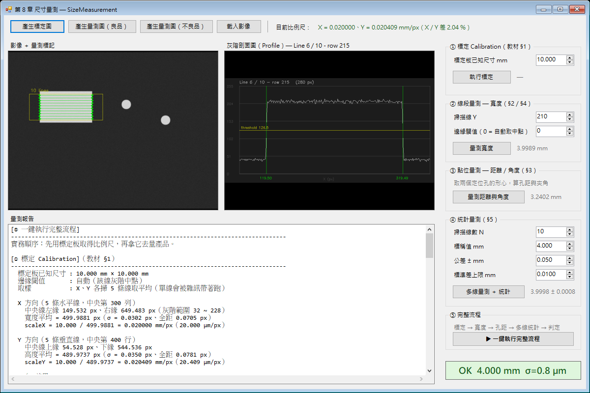
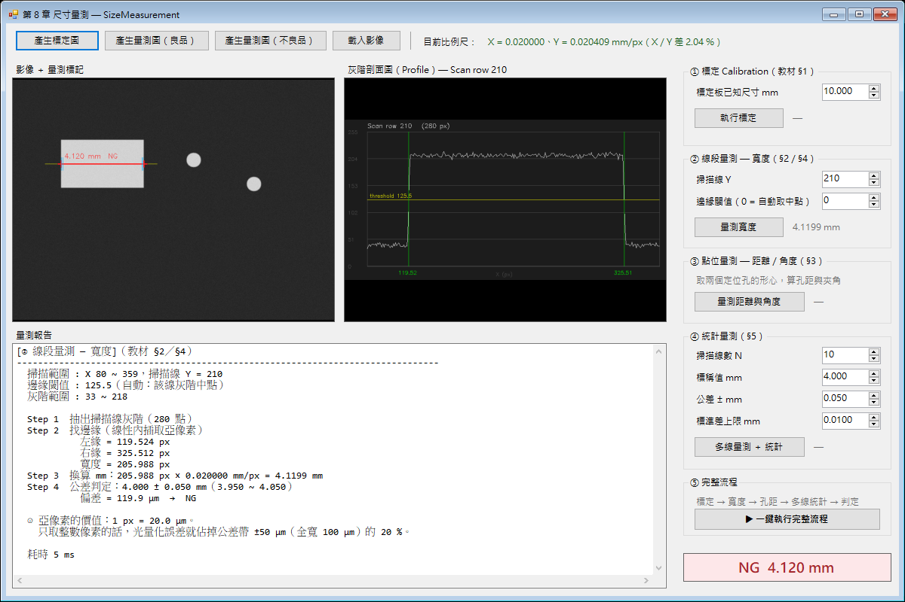
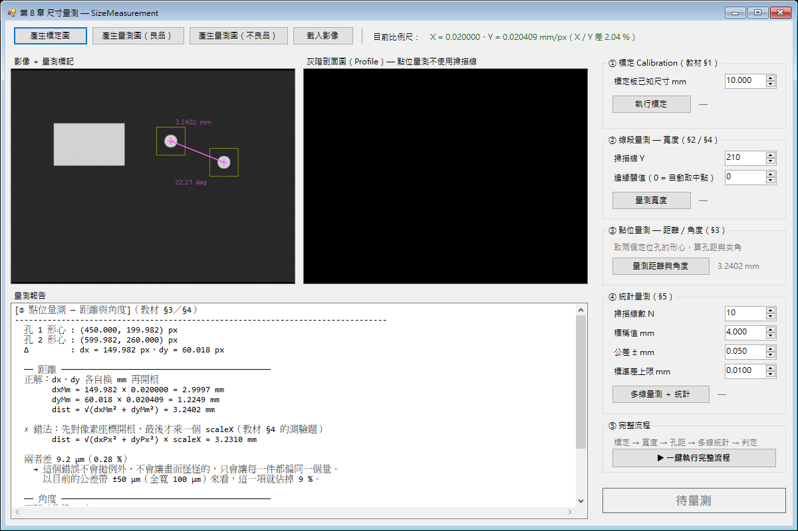

# SizeMeasurement — 第 8 章 尺寸量測 範例程式

《AOI 工程師養成教材》第 8 章的隨堂範例。用最小可執行的 WinForms 程式，把尺寸量測的四件事跑給你看：
**標定（mm/px）**、**線段量測（亞像素邊緣）**、**點位量測（距離與角度）**、**統計（平均值與標準差）**。

不需要準備任何影像檔——程式內建合成測試圖產生器，一張標定板、一張良品、一張不良品，按鈕按下去就有圖可以量。



第 7 章的特徵檢測回答「有沒有問題」，第 8 章回答「差了多少」。
差多少要有單位，單位來自標定——所以這支程式的第一顆按鈕永遠是「產生標定圖」。

---

## 環境需求

技術棧與第 7 章 `FeatureDetection` 完全一致，兩章可以共用同一份部署說明。

| 項目 | 版本 | 說明 |
|------|------|------|
| Visual Studio | 2022 | 需勾選「.NET 桌面開發」 |
| .NET Framework | 4.7.2 開發套件 | Targeting Pack，非只有 Runtime |
| 作業系統 | Windows x64 | `cvextern.dll` 只有 x64／x86 原生版 |
| Emgu.CV | 4.4.0.4099 | 由 NuGet 還原，**不要升級**，原因見下 |

第一次開啟方案後 NuGet 會自動還原；若沒有，在 **Developer Command Prompt for VS 2022** 執行：

```bash
msbuild SizeMeasurement.sln -t:restore
```

## 建置與執行

用 Visual Studio 開啟 `SizeMeasurement.sln`，直接 F5。或在 Developer Command Prompt：

```bash
msbuild SizeMeasurement.sln -t:restore,build -p:Configuration=Debug
```

執行檔輸出在 `SizeMeasurement\bin\Debug\SizeMeasurement.exe`。
建置時會看到 `Emgu.CV.runtime.windows nuget package deploying x86 x64 binary for Windows`，
代表原生 DLL 已複製到輸出目錄的 `x64\` 子資料夾（`cvextern.dll` 約 33 MB）——**沒有這行就一定跑不起來**。

## 操作流程

1. 按左上角 **「產生標定圖」**，再按右側 ①「執行標定」——先有 mm/px，後面才有 mm
2. 按 **「產生量測圖（良品）」**，依序執行右側 ② ③ ④
3. 或直接按 **⑤「一鍵執行完整流程」**，把「標定 → 寬度 → 孔距 → 多線統計 → 判定」整條路跑一次，並顯示每步耗時
4. 想看 NG 的樣子，按 **「產生量測圖（不良品）」** 再執行 ② 或 ④

左側顯示影像與量測標記（黃線 = 掃描線、綠／紅 = 量測線段與 OK／NG、青線 = 公差帶上下限、洋紅十字 = 特徵點形心），
右側顯示**灰階剖面圖**，下方輸出完整的量測報告。

**右側的剖面圖是本章最值得看的一張圖**：邊緣不是「一條線」，而是灰階從低爬到高的一段斜坡；
閾值切在斜坡的哪個高度，就決定了邊緣座標落在哪裡。看過這張圖才會理解為什麼閾值要取明暗中點、
以及為什麼在跨過閾值的兩點之間做內插，就能把解析度推進到 1 px 以下。

---

## 四個工具

| 工具 | 用途 | 教材 | 什麼時候用 |
|------|------|------|-----------|
| ① 標定 | 由已知尺寸的標定板算出 mm/px | §1 | 每次換鏡頭、調焦、動到相機安裝位置之後 |
| ② 線段量測 | 掃一條線找成對邊緣，相減得寬度 | §2／§4 | 元件尺寸、線寬、間距 |
| ③ 點位量測 | 取特徵點座標，算兩點距離與夾角 | §3／§4 | 孔距、孔位偏移、安裝角度 |
| ④ 統計量測 | 掃多條線取平均值與標準差 | §5 | 精密量測；判定量測本身穩不穩 |

判定用兩個條件，缺一不可：**平均值落在公差內** AND **標準差夠小**。
只看平均值就判 OK 是教材 §5 情境判斷題的錯誤答案——平均值過關可能只是運氣，
數值大幅抖動代表這個量測本身不可信。



上圖是不良品（206 px = 4.1199 mm）的量測結果。量測線段轉紅、判定燈轉紅，
兩端的**青色短線就是公差帶的上下限**——量到的右邊緣明顯落在青線之外，NG 一眼就看得出來，
不必去讀數字。這就是教材 §6 要求「量測結果一定要標在影像上」的理由。

## 內建測試圖

`800 × 600` 8-bit 灰階，固定亂數種子，每次產生的圖完全相同，方便對照講解。

影像取 800 × 600 而不是沿用第 7 章的 640 × 480，是為了放得下 500 px 的標定板，
好讓標定結果剛好對上教材 §1 的例子：`10.000 mm / 500 px = 0.020 mm/px`。

### 標定圖

| 元素 | 規格 | 教學點 |
|------|------|--------|
| 背景 | 灰階 40 | 暗場，模擬背光打光 |
| 標定板 | **500 × 490 px**，灰階 220，已知 10.000 mm × 10.000 mm | scaleX = 0.020000、scaleY = **0.020409** mm/px |

**Y 方向刻意比 X 少 10 px（差 2%）**，不是畫錯——模擬教材 §1 講的鏡頭畸變／感光元件微小非方形／安裝傾斜。
這就是「X、Y 必須分開標定」的實證：假設兩者相同，後面的斜向距離就會系統性錯 2%。

### 量測圖（良品／不良品）

| 元素 | 規格 | 換算 | 教學點 |
|------|------|------|--------|
| 待測元件 | 200 × 120 px（不良品 206 px） | 4.000 mm ／ 4.120 mm | ② 線段量測 + 公差判定 |
| 定位孔 ×2 | 半徑 18 px，圓心相距 dx = 150、dy = 60 px | 見下表 | ③ 點位量測 |
| 鏡頭模糊 | 高斯 3×3 | — | 邊緣變成灰階過渡帶，亞像素內插才有作用 |
| 感測器雜訊 | 高斯 σ = 3 灰階 | — | 每條掃描線結果略有不同，§5 的標準差才有東西可算 |

兩者的順序照物理現實：**先模糊（光學端）再雜訊（感測端）**。

### 兩孔距離：本章最重要的一組數字



| 算法 | 結果 | 差異 |
|------|------|------|
| **正解**：dx、dy 各自換 mm 再開根 | **3.2402 mm** | — |
| **錯法**：先對像素座標開根，最後才乘一個 scaleX | 3.2310 mm | 差 **9.2 μm** |
| 角度正解：`atan2(dyMm, dxMm)` | 22.212° | — |
| 角度錯法：直接用像素座標 `atan2(dyPx, dxPx)` | 21.810° | 差 **0.403°** |

錯法就是教材 §4 自我檢核「找出問題」那一題。9.2 μm 在公差 ±50 μm（帶寬 100 μm）的場合佔掉近一成公差帶，
而且**不會拋例外、畫面上完全看不出異狀，只會讓每一件都偏同一個量**。

程式把正解與錯法**並排印在報告裡**（`Calibration.DistanceMmWrongDemo()` 就是為此存在的示範用方法），
讓這個抽象的錯誤變成兩個看得見的數字。

---

## 專案結構

```
SizeMeasurement\
├── SizeMeasurement.sln
├── README.md
├── .gitignore
├── docs\                          README 用的截圖
└── SizeMeasurement\
    ├── SizeMeasurement.csproj     舊式專案檔（非 SDK-style）
    ├── App.config
    ├── Program.cs                 進入點
    ├── Calibration.cs             §1 比例尺與 px↔mm 換算（不可變物件）
    ├── MeasureOps.cs              §2〜§5 量測演算法，零 UI 相依
    ├── TestImageGenerator.cs      合成測試圖產生器
    ├── Form1.cs                   事件處理、可視化、量測報告
    ├── Form1.Designer.cs          版面（ClientSize 1184 × 761）
    ├── Form1.resx
    └── Properties\AssemblyInfo.cs
```

程式碼刻意切成三層，界線很清楚：

- **`MeasureOps`** 只吃 `Mat`、只吐「像素」單位的數值。它不知道 mm 是什麼。
- **`Calibration`** 只負責 px ↔ mm 的換算，它不知道影像是什麼。
- **`Form1`** 負責把兩者接起來、畫圖、寫報告。

這條界線不是為了漂亮：量測與標定的錯誤來源完全不同（前者是演算法與取像，後者是標定板與參數管理），
分開之後才能分開驗證、分開排查。搬進正式專案時，前兩個檔案可以整包移到演算法層。

---

## 關鍵設計決定

### 1. Emgu.CV 鎖 4.4.0.4099、`PlatformTarget` 鎖 x64

理由與第 7 章相同，不重複展開：舊式專案檔只吃 `.targets` 形式的原生資產部署，
4.12 只有 `runtimes\`（SDK-style RID 資產）會編譯成功但執行期找不到 `cvextern.dll`；
`PlatformTarget=x64` 則是為了避免 `Prefer32Bit` 預設值把行程跑成 32 位元、載入 `x86\cvextern.dll`。
詳細的 PE 標頭實測表在 `07_特徵檢測\FeatureDetection\README.md`。

`LangVersion` 一併鎖 **C# 6.0**（第 14 章規範），讓編譯器直接擋掉 tuple／pattern matching 等新語法。

### 2. 邊緣一定要取亞像素

線性內插只有一行，但它決定了量測的解析度上限：

```csharp
pos = i + (threshold − p[i]) / (p[i+1] − p[i]);
```

本範例 1 px = 20 μm。若只回傳整數索引，光量化誤差就佔掉 ±50 μm 公差帶（全寬 100 μm）的 **20%**——
還沒開始量就先輸掉五分之一的公差。

前緣從頭往後找、後緣**從尾端往前找**，取到的是「最外側的一對邊緣」。
若兩者都從頭掃，元件內部只要有一顆亮點或一道刮痕，就會提早配對到內部的假邊緣，量出來的寬度整個變短。

### 3. 標定不會只掃一條線

程式在 X、Y 各掃 **5 條線取平均**（`CalibLineCount`）。實測差異：

| 取樣方式 | scaleX 量到的值 |
|---------|----------------|
| 單線 | 0.020002 mm/px（差 0.01%） |
| **5 條線平均** | **0.020000 mm/px** |

差別不大，但**比例尺標偏是沒有自我修正機會的錯**——它會讓之後每一件產品的 mm 全部跟著偏。
標定屬於「一次定生死」的工作，多掃幾條線把雜訊壓到 1/√N 是最便宜的保險。
這也是 §5「多次量測取統計」在本程式的第一次登場，比第 ④ 步還早。

### 4. `Mat.Step` ≠ `Mat.Width`

抽掃描線是用指標位移直接讀記憶體，位移**必須**用 `Step`：

```csharp
IntPtr rowStart = IntPtr.Add(gray.DataPointer, y * gray.Step + x0);
```

OpenCV 每一列的開頭會做記憶體對齊，`Step`（一列的位元組數）通常大於等於 `Width`。
影像寬度剛好是 4 的倍數時兩者相等，用 `Width` 也「看起來正常」；
換一張寬度不是 4 倍數的圖，就會逐列偏移、profile 整條歪掉，**而且不會拋任何例外**。

### 5. `CvInvoke.PutText` 不支援中文

OpenCV 的內建字型沒有中文字模，中文一律變成問號。
所以影像上的標註只放數字與英文（`4.000 mm`、`OK`／`NG`、`22.21 deg`），中文說明留在報告與 UI 控制項。
真要在影像上寫中文得改用 GDI+ `Graphics.DrawString` 另外畫——那時 `Font`／`Brush`／`Graphics`
都是 GDI 物件，一樣要 `using` 包好（第 18 章）。

### 6. 填滿矩形的閉區間 off-by-one

`CvInvoke.Rectangle` 的填滿模式是閉區間：傳 `Rectangle(120, 150, 200, 120)` 實際畫出 **201 × 121** px。
測試圖要求量出來剛好 200.0 px 才對得上教材數字，所以產生器內部寬高各減 1 補償。
這個坑在做面積、尺寸判定時一定會咬人（第 7 章 README 也記錄過）。

### 7. `ToBitmap()` 的共享 buffer 陷阱

Emgu 的 `Mat.ToBitmap()` 對 3 通道 BGR 會**與 Mat 共用像素 buffer**。把那張 Bitmap 交給 `PictureBox`，
等 `Mat` 離開 `using` 被釋放後，下一次重繪就是 AccessViolation，而且**不會進 `try/catch`**。
本專案的 `Form1.ToDisplayBitmap()` 一律複製一份獨立點陣圖，不依賴哪種格式剛好會複製（那是版本相依的實作細節）。
完整分析在第 7 章 README 與 `ToDisplayBitmap()` 的註解裡。

---

## 資源釋放紀律

這支範例同時是第 18／19 章的示範，程式碼嚴格遵守：

- `Mat` 欄位覆蓋一律**暫存 → 換新 → 放舊**，不寫 `_mat = f(_mat)` 這種自我覆蓋
- `PictureBox.Image` 換圖時自己 `Dispose` 舊值（PictureBox 不會幫你放）
- 所有中間 `Mat` 一律 `using`；回傳 `Mat` 的方法在例外路徑也會釋放已配置的物件
- 回傳 `Mat` 的方法都在 XML 註解標明「呼叫端負責 Dispose」

特別提一個第 7 章沒出現過的物件：**`CvInvoke.Moments()` 回傳的 `Moments` 是非受管資源的包裝物件**，
不是單純的結構。它長得像一包統計數字，很容易被當成 value type 用完就丟——
忘了 `Dispose` 就是每量一次漏一點。`MeasureOps.FindBrightCentroid()` 用 `using` 包住它。

---

## 驗證狀態

| 項目 | 結果 |
|------|------|
| Debug／Release 從零重建 | 零錯誤、零警告 |
| 原生 DLL 部署 | `bin\Debug\x64\cvextern.dll` 32.7 MB |
| 標定（10.000 mm 標定板，5 線平均） | X 499.9881 px → **0.020000 mm/px**（σ 0.030 px）<br>Y 489.9737 px → **0.020409 mm/px**（σ 0.035 px）<br>X／Y 差 **2.04%** |
| 良品寬度（單線 Y = 210） | 199.939 px → **3.9989 mm**，偏差 −1.1 μm → **OK** |
| 不良品寬度 | 205.988 px → **4.1199 mm**，偏差 +119.9 μm → **NG** |
| 孔距（正解／錯法） | 3.2402 mm ／ 3.2310 mm，差 9.2 μm |
| 角度（正解／直接用 px） | 22.212° ／ 21.810°，差 0.403° |
| 10 線統計 | 平均 **3.9998 mm**、σ **0.0008 mm（0.76 μm）**、全距 0.0024 mm → **OK** |
| 控制項邊界 | 全部落在客戶區 1184 × 761 內 |
| **資源洩漏（第 19 章驗收）** | 102 次量測運算後 **GDI 41 → 41、USER 84 → 84**，完全持平 |

記憶體 Private bytes 在 102 次運算後 44.5 → 47.9 MB，成長呈遞減趨緩
（前 30 次 +2.0 MB、第 30 → 60 次 +0.8 MB、第 90 → 102 次 +0.0 MB），是 GC 堆穩定的曲線，不是單調上升的洩漏。

> 良品量到 3.9989 mm 而不是漂亮的 4.0000 mm，是**感測器雜訊造成的真實量測誤差**（−1.1 μm），
> 不是程式算錯。掃 10 條線取平均就收斂到 3.9998 mm——這正是第 ④ 步要教的事。

---

## 已知限制

這是**教學範例**，不是產線程式。以下是刻意留下、正式專案必須處理的：

- **掃描線與搜尋範圍都是固定座標**（教材踩雷 P-001）。這隱含「產品每次放的位置都一樣」。
  產線若無入片對位機構，必須先用模板匹配（第 9 章）算出偏移量再動態修正。
  ③ 點位量測的兩個搜尋框更是為內建測試圖寫死的，換影像就對不到。
- **標定值不做持久化**。每次按「執行標定」重算一次。正式專案的 Scale 屬於機台參數，
  必須存進 Recipe／INI（第 16 章），開機讀取、換鏡頭才重標，而不是每次量測前重算。
- **標定只有單一 Scale，不做鏡頭畸變校正**。本範例用「X、Y 各一個比例尺」處理非等向；
  真正的鏡頭畸變（桶狀／枕狀）是位置的函數，要用標定板網格擬合多項式模型才能校正。
- **參數散在 UI 與 `const`**。掃描線數、公差、標準差上限已拉到 UI 可調，
  但標定線數（`CalibLineCount`）、孔的二值化閾值、測試圖規格仍是 `const`。這些在正式專案全都屬於機台參數。
- **不做圓／弧擬合，不算 Cpk／Ppk**。教材 §5 只列了名詞，實作留給正式專案。
- **單執行緒**。所有運算在 UI 執行緒同步跑，影像大時會卡畫面。正式專案要照第 17 章拆執行緒。
- **不支援高 DPI**。程式未宣告 DPI 感知。實測在 125% 縮放的顯示器上，
  Windows 回報視窗 1500 × 1000，實際繪製內容只有 1200 × 800 再被點陣拉伸——所以字會有點糊。

## 相關章節

第 6 章前處理、第 7 章特徵檢測（邊緣偵測是本章的前置）、第 9 章模板匹配與定位（動態修正掃描線位置）、
第 10 章相機鏡頭光源（邊緣過渡帶的來源）、第 14 章技術棧與規範、第 16 章 Recipe 參數、
第 18／19 章記憶體與資源釋放、第 20 章 UI 守則。

---

© 2026 Garnett.Chien — 版權所有。請勿用於私自營利用途。
