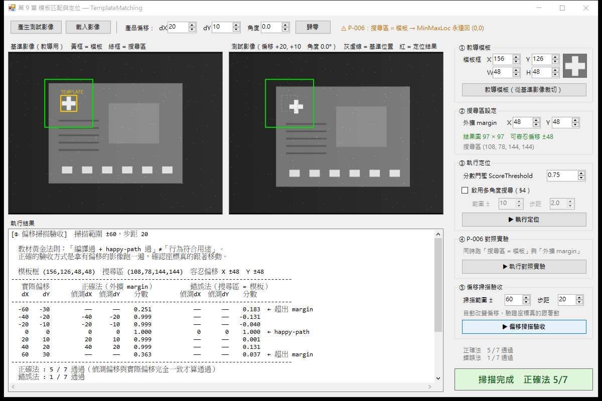
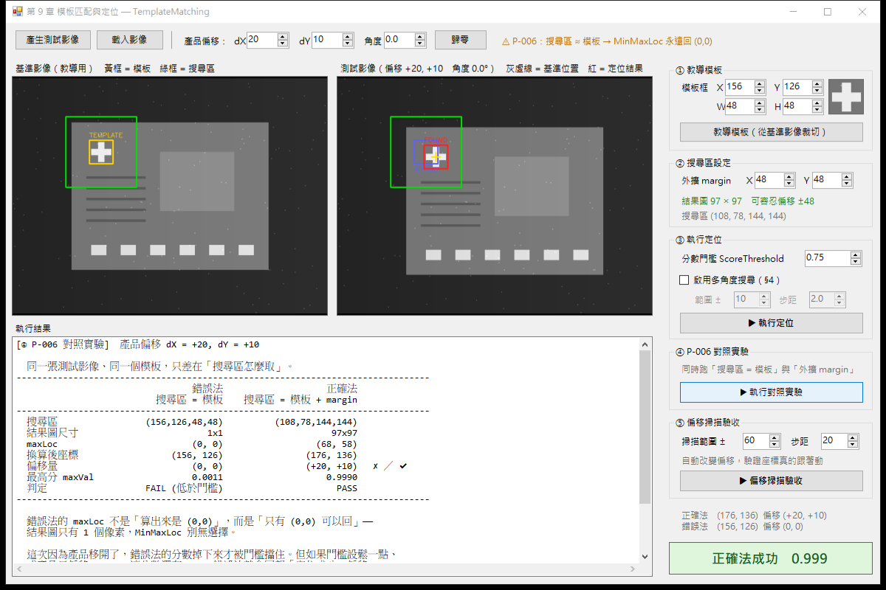

# TemplateMatching — 第 9 章 模板匹配與定位 範例程式

Medium文章連結 : https://medium.com/@GarnettChien/aoi-9-%E6%A8%A1%E6%9D%BF%E5%8C%B9%E9%85%8D%E8%88%87%E5%AE%9A%E4%BD%8D-%E5%BD%B1%E5%83%8F%E5%B0%8D%E4%BD%8D-3c1d478a44ac?postPublishedType=repub


《AOI 工程師養成教材》第 9 章的隨堂範例。用最小可執行的 WinForms 程式，示範 AOI 定位的完整流程：
**教導模板 → 設搜尋區 → 定位 → 算偏移量 → 套用到所有後續 ROI**。



上圖的表格就是整章的濃縮。同一張影像、同一個模板，只差在搜尋區怎麼取：
正確法的偵測座標跟著實際偏移一路走，錯誤法從頭到尾鎖死在 `(0, 0)`。
而 **`dX = 0` 那一列，兩種方法的結果完全一樣、分數都是 1.000**——
這正是「用影像自身裁切當模板、再搜尋同一張影像」的單元測試會全綠的原因。

---

## 環境需求

| 項目 | 版本 | 說明 |
|------|------|------|
| Visual Studio | 2022 | 需勾選「.NET 桌面開發」 |
| .NET Framework | 4.7.2 開發套件 | Targeting Pack，非只有 Runtime |
| 作業系統 | Windows x64 | `cvextern.dll` 只有 x64／x86 原生版 |
| Emgu.CV | 4.4.0.4099 | 由 NuGet 還原，**不要升級**，原因見下 |

## 建置與執行

用 Visual Studio 開啟 `TemplateMatching.sln`，直接 F5。或在 **Developer Command Prompt for VS 2022**：

```bash
msbuild TemplateMatching.sln -t:restore,build -p:Configuration=Debug
```

建置時會看到 `Emgu.CV.runtime.windows nuget package deploying x86 x64 binary for Windows`，
代表原生 DLL 已複製到輸出目錄的 `x64\` 子資料夾——**沒有這行就一定跑不起來**。

## 操作流程

1. 按左上角 **「產生測試影像」**（或「載入影像」讀入自己的圖）
2. 用上方的 **dX / dY / 角度** 設定產品偏移——這是驗收定位功能的關鍵
3. 右側面板依序按 ① ～ ⑤

左側是**基準影像**（教導用，黃框 = 模板、綠框 = 搜尋區），
右側是**測試影像**（灰虛線 = 基準位置、紅框 = 定位結果、黃十字 = 匹配中心）。

---

## 五個功能

| # | 功能 | 對應教材 |
|---|------|---------|
| ① | **教導模板** — 從基準影像裁出模板，記下基準位置 | 新手補充「模板怎麼教導」 |
| ② | **搜尋區設定** — 調 margin，**即時**顯示結果圖尺寸與可容忍偏移 | §3 |
| ③ | **執行定位** — 完整推導座標換算，含多角度搜尋選項 | §1、§4 |
| ④ | **P-006 對照實驗** — 同一張圖，兩種搜尋區取法並列 | P-006 |
| ⑤ | **偏移掃描驗收** — 黃金法則的自動化版本 | 黃金法則 |

### ④ P-006 對照實驗



| | 錯誤法（搜尋區 = 模板） | 正確法（模板 + margin） |
|---|---|---|
| 搜尋區 | `(156,126,48,48)` | `(108,78,144,144)` |
| 結果圖尺寸 | **1 × 1** | 97 × 97 |
| `maxLoc` | `(0, 0)` | `(68, 58)` |
| 偏移量 | `(0, 0)` ✘ | `(+20, +10)` ✔ |
| 最高分 | 0.0011 | 0.9990 |

錯誤法的 `maxLoc` 不是「算出來是 `(0,0)`」，而是**「只有 `(0,0)` 可以回」**——
結果圖只有 1 個像素，`MinMaxLoc` 別無選擇。

## 內建測試影像

`640 × 480` 8-bit 灰階，**產品位置可控**（上方 dX / dY / 角度）：

| 元素 | 規格 | 用途 |
|------|------|------|
| 背景 | 灰階 40，含梯度 | — |
| 產品本體 | 400 × 300，灰階 120，標稱位置 (120, 90) | — |
| **十字定位標記** | 40 × 40，灰階 240 | **模板目標**（高對比、有紋理） |
| 焊墊 ×6 | 30 × 20，灰階 224 | 讓影像其他處也有紋理 |
| 走線 ×5 | 120 × 4，灰階 90 | 同上 |
| **平坦無紋理區** | 150 × 120，灰階 140，位於 (300, 150) | 「壞模板」示範區 |
| 雜訊 | 160 個 2×2 亮點 | **固定在感測器座標，不隨產品移動** |

雜訊固定在感測器座標是刻意的：這樣偏移 0 的那張圖與基準完全一致（分數剛好 1.000），
其他偏移量則因為落在標記上的雜訊不同而略低於 1，貼近真實。

**壞模板實驗**：把模板框拉到平坦區 `(300, 150, 48, 48)` 再跑一次掃描：

| 產品偏移 | 分數 | 偵測偏移 |
|---|---|---|
| 0 | 1.0000 | (0, 0) ✔ |
| +20 | 0.3814 | (0, 0) ✘ |

平坦區到處都長得一樣，沒有可辨識的特徵——這就是教材說「模板要選高對比、有獨特紋理的區域」的實測依據。

---

## 專案結構

```
TemplateMatching\
├── TemplateMatching.sln
├── README.md
├── .gitignore
├── docs\                           README 用的截圖
└── TemplateMatching\
    ├── TemplateMatching.csproj     舊式專案檔（非 SDK-style）
    ├── App.config
    ├── Program.cs                  進入點
    ├── TemplateOps.cs              定位演算法，零 UI 相依
    ├── TestImageGenerator.cs       產品位置可控的合成影像
    ├── Form1.cs                    事件處理與影像顯示
    ├── Form1.Designer.cs           版面（ClientSize 1184 × 761）
    ├── Form1.resx
    └── Properties\AssemblyInfo.cs
```

`TemplateOps.cs` 刻意不碰任何 UI——只吃 `Mat`、吐數值，方便單獨閱讀與測試。

---

## 四個關鍵設計決定

### 1. Emgu.CV 鎖 4.4.0.4099，不要升級

舊式（非 SDK-style）專案檔**只吃 `.targets` 形式的原生資產部署**：

| 版本 | `build\` 資料夾 | 舊式專案可用？ |
|------|----------------|--------------|
| 4.4.0.4099 | 有 `Emgu.CV.runtime.windows.targets` | ✅ |
| 4.12.0.5764 | 無 `build\`，只有 `runtimes\`（SDK-style RID 資產） | ❌ |

升級會編譯成功但執行期找不到 `cvextern.dll`。

專案同時鎖 `<PlatformTarget>x64</PlatformTarget>`：`Microsoft.NETFramework.CurrentVersion.props`
對「.NET Framework + `WinExe` + 非 v4.0」的專案會把 `Prefer32Bit` 預設成 `true`，
純 AnyCPU 建置出來的 PE 標頭是 `x86 / Bit32Preferred = True`，會跑成 32 位元行程。

### 2. 教導模板一定要 `Clone()`

```csharp
using (Mat view = new Mat(source, templateRect))
    return view.Clone();
```

`new Mat(src, rect)` 只共享 header，像素資料仍屬於 `src`。
模板要活得比來源影像久（來源會一直換成新的測試影像），不複製的話來源一釋放模板就成了懸空指標。

**這與第 7 章 ROI 的「刻意共享」正好相反**，差別只在於「誰要活得比較久」。

### 3. 搜尋區的邊界夾法比教材示意碼完整

教材 P-006 的示意程式用這樣夾邊界：

```csharp
Math.Min(imgW, templateRect.Width + marginX * 2)     // 只夾了寬度
```

這沒有考慮起點 `X`，模板靠近影像右緣時 `X + Width` 仍可能超出影像。
本專案的 `BuildSearchRect()` 改成夾「右下角座標」再回推寬高：

```csharp
int left   = Math.Max(0, templateRect.X - marginX);
int top    = Math.Max(0, templateRect.Y - marginY);
int right  = Math.Min(imageWidth,  templateRect.Right  + marginX);
int bottom = Math.Min(imageHeight, templateRect.Bottom + marginY);
return new Rectangle(left, top, right - left, bottom - top);
```

### 4. `ToBitmap()` 的共享 buffer 陷阱

Emgu 的 `Mat.ToBitmap()` 對不同通道數的行為**不一致**：

| Mat 型態 | 輸出格式 | 是否與 Mat 共用像素 buffer |
|---------|---------|------------------------|
| 1 通道灰階 | `Format8bppIndexed` | 否（要建調色盤所以複製） |
| **3 通道 BGR** | `Format24bppRgb` | **是** |

把共用 buffer 的那張 Bitmap 交給 `PictureBox`，等 `Mat` 離開 `using` 被釋放後，
下一次重繪就是 AccessViolation，而且**不會進 `try/catch`**——整個行程無聲消失。
更陰險的是它不會馬上死，要等那塊記憶體被別的配置重用才炸，崩潰點與元兇相隔很遠。

本專案用 `Form1.ToDisplayBitmap()` 一律複製一份獨立點陣圖，
**不依賴哪種格式剛好會複製**（那是版本相依的實作細節）。

> 這個 bug 在第 7 章的範例開發時真的踩過：第一次點按鈕正常，第二次程式直接消失。

---

## 兩個實測才發現的行為

### 旋轉時「偏移量」不再等於平移量

產品設偏移 `(20, 10)` 再加旋轉 4°，多角度搜尋偵測到的偏移是 **`(14, 20)`**。

這是物理上正確的：定位標記在 `(180, 150)`，離旋轉中心 `(320, 240)` 有一段距離，
繞中心旋轉會讓它額外位移。**實務意義是：有旋轉時單靠一個標記算不出純平移量**，
需要兩個以上的定位點才能同時解出平移與旋轉。

### 多角度搜尋的時間代價

| 方式 | 分數 | 耗時 |
|------|------|------|
| 單角度 | 0.920 | 1.15 ms |
| 多角度（±10°，步距 2°，11 個角度） | 0.979 | 9.71 ms |

**8.4 倍**。教材 §4 說「角度數 × 搜尋區大小決定運算時間」，所以務必**先縮小搜尋區、再做多角度**，順序不能反。

---

## 資源釋放紀律

這支範例同時是第 18／19 章的示範，程式碼嚴格遵守：

- `Mat` 欄位覆蓋一律**暫存 → 換新 → 放舊**（`SetRefMat` / `SetTestMat` / `SetTemplate`）
- `PictureBox.Image` 換圖時自己 `Dispose` 舊值（PictureBox 不會幫你放）
- 所有中間 `Mat` 一律 `using`；回傳 `Mat` 的方法在例外路徑也會釋放已配置的物件
- 回傳 `Mat` 的方法都在 XML 註解標明「呼叫端負責 Dispose」

## 驗證狀態

| 項目 | 結果 |
|------|------|
| Debug / Release 從零重建 | 零錯誤、零警告 |
| 五個功能 GUI 實測 | 全部正確，結束碼 0 |
| 定位精度 | 偵測偏移與設定偏移**完全一致**（容忍範圍內 5/5） |
| P-006 重現 | 錯誤法結果圖恆為 1×1、`maxLoc` 恆為 `(0,0)` |
| 控制項邊界 | 全部落在客戶區 1184 × 761 內 |
| **資源洩漏（第 19 章驗收）** | 60 次操作 + 4 次偏移掃描（共 **116 次模板匹配**）後<br>**GDI 48 → 48、USER 111 → 111、Handles 402 → 402，全部零變化** |

記憶體 Private bytes 從基準 40.8 MB 升到第 10 輪的 47.1 MB 後**回落**到 45.3 MB，是 GC 堆的平台期，不是洩漏。

---

## 已知限制

這是**教學範例**，不是產線程式：

- **只用單一定位點**。有旋轉時算不出純平移量（見上），實務需要兩個以上的定位標記。
- **多角度是暴力法**。逐角度各做一次完整匹配，沒有做粗掃再細掃、也沒有多解析度金字塔加速。
  教材 §6 排查表的「速度太慢」那列就是在講這個。
- **參數散在 UI 與程式碼**。margin、門檻、角度範圍已拉到 UI，但正式專案這些全屬機台參數，
  必須進 Recipe／INI（第 16 章）。
- **單執行緒**。所有運算在 UI 執行緒同步跑，偏移掃描時會短暫卡住畫面（已改成等待游標）。
- **不支援高 DPI**。程式未宣告 DPI 感知，在縮放非 100% 的顯示器上會被 Windows 點陣拉伸而模糊。

## 相關章節

第 7 章特徵檢測（P-001 固定座標 ROI 會漂移 ← **本章就是它的解法**）、
第 8 章尺寸量測、第 14 章技術棧與規範、第 16 章 Recipe 參數、
第 18／19 章記憶體與資源釋放、第 20 章 UI 守則。

---

© 2026 Garnett.Chien — 版權所有。請勿用於私自營利用途。
